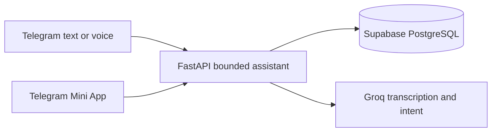

<p align="center">
  
</p>

<h1 align="center">PR-Agent</h1>

<p align="center">
  A privacy-first Telegram companion for tracking work, money, notes, reminders, goals, nutrition, and important personal facts by text or voice.
</p>

<p align="center">
  <a href="https://t.me/Arpan_1_bot?start=public"><strong>Open PR-Agent in Telegram</strong></a>
  ·
  <a href="https://excited-dolphin-ec9.notion.site/PR-Agent-progress-report-agent-3c4f42f3d9fb80af94c3d94683c44a33?source=copy_link">Build notes</a>
</p>

## What it does

- Captures text or voice as work logs, notes, expenses, income, goals, reminders, or meals.
- Tracks Indian household foods with visible calorie and protein assumptions.
- Answers date-aware spending and activity questions from the user's own history.
- Provides a Telegram Mini App for reviewing, filtering, editing, and deleting records.
- Supports an optional encrypted, masked, confirmation-gated vault for personal facts.



Every query and mutation is scoped server-side to the authenticated Telegram owner. Voice audio is not retained after transcription. Natural-language text and voice use a configurable daily allowance; once reached, voice is rejected before transcription. The free staging profile temporarily allows 100 requests per user while acceptance testing is in progress. Deterministic slash commands remain available.

## Try it

These exact forms work without follow-up questions:

```text
/log Finished release testing
/note Submit scholarship form
/expense 240 INR dinner
```

<table align="center">
  <tr>
    <td align="center" width="50%">
      
      <br><sub>Speak or type. PR-Agent keeps the record structured.</sub>
    </td>
    <td align="center" width="50%">
      <a href="https://t.me/Arpan_1_bot?start=public">
        
      </a>
      <br><sub>Scan to start, then pin the chat so it stays easy to find.</sub>
    </td>
  </tr>
</table>

## Release checks

| Scenario tested | Outcome |
|---|---|
| A second user attempts to read, edit, or delete another user's record | Denied; no cross-user data returned |
| A user reaches the configured allowance and sends another voice note | Rejected before transcription is called |
| Mini App authentication and CRUD run on a Telegram-sized mobile viewport | Passed, including validation, nutrition totals, and session expiry |
| Spending is queried by period, search term, and highest category | Correct period and ranking returned; empty periods remain empty |
| Indian meal variants and user-supplied calories/protein are logged | Distinct estimates preserved; vague portions require review |

Verified locally on 23 August 2026: 352 backend tests, 13 frontend tests, and 6 mobile browser flows passed; lint, type-check, and production build also passed.

## Technical notes

- Backend: FastAPI, SQLAlchemy, Alembic
- Frontend: Next.js, React, TypeScript, Tailwind CSS
- Data: Supabase PostgreSQL
- Delivery: Telegram Bot API, webhook processing, scheduled workers
- Validation: pytest, Vitest, Playwright

## Deployment notes

- Put the primary Groq credential in Render's masked `GROQ_API_KEY` variable.
  Put optional additional credentials in masked `GROQ_API_KEYS` as a
  comma-separated list. Never commit or paste real keys into source control.
- Free staging uses the API's ten-minute self-ping to stay ahead of Render's
  ordinary idle window. An API marked `suspend-by-user` must first be resumed
  in the Render dashboard; an HTTP ping cannot override that state.
- The free staging AI allowance is temporarily 100 requests per user per day
  for acceptance testing. Restore `PER_USER_DAILY_AI_LIMIT` to 25 afterward.

## Run locally

```powershell
Copy-Item .env.example .env
docker compose up --build
```

The Mini App must be opened inside Telegram so its signed launch data can be verified. Never commit tokens, database URLs, exports, or encryption keys.

## License

MIT
