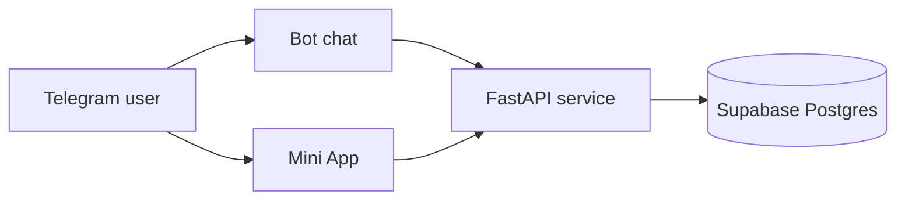

# PR-Agent

PR-Agent is a private Telegram companion for capturing everyday information
without turning it into another complicated app. Users can speak naturally,
type a request, or open the Mini App to manage structured records.

[Open PR-Agent in Telegram](https://t.me/Arpan_1_bot?start=public)

[](https://t.me/Arpan_1_bot?start=public)

## What it handles

- work logs, notes, reminders, and goals;
- income and expense tracking in multiple currencies;
- approximate Indian meal and daily protein tracking;
- text and voice capture with confirmation before ambiguous writes;
- editable Mini App records, export, and account deletion; and
- an optional encrypted vault for permitted personal facts.



Identity comes from Telegram's signed Mini App data. The API never trusts an
owner ID supplied by the browser, and every read, edit, and deletion is scoped
to the authenticated owner. AI can interpret a request, but deterministic
application code validates and writes it.

## Stack

- FastAPI, SQLAlchemy, Alembic, PostgreSQL
- Next.js, React, TypeScript, Tailwind CSS
- Telegram Bot API
- pytest, Vitest, Playwright

## Run locally

```powershell
Copy-Item .env.example .env
docker compose up --build
```

The Mini App must be opened from Telegram; it does not accept manually entered
Telegram IDs or a shared dashboard password.

## Validate

```powershell
Set-Location backend
python -m pytest

Set-Location ..\frontend
corepack pnpm typecheck
corepack pnpm lint
corepack pnpm test
corepack pnpm build
```

Never commit tokens, database URLs, private exports, or encryption keys.

## License

MIT
